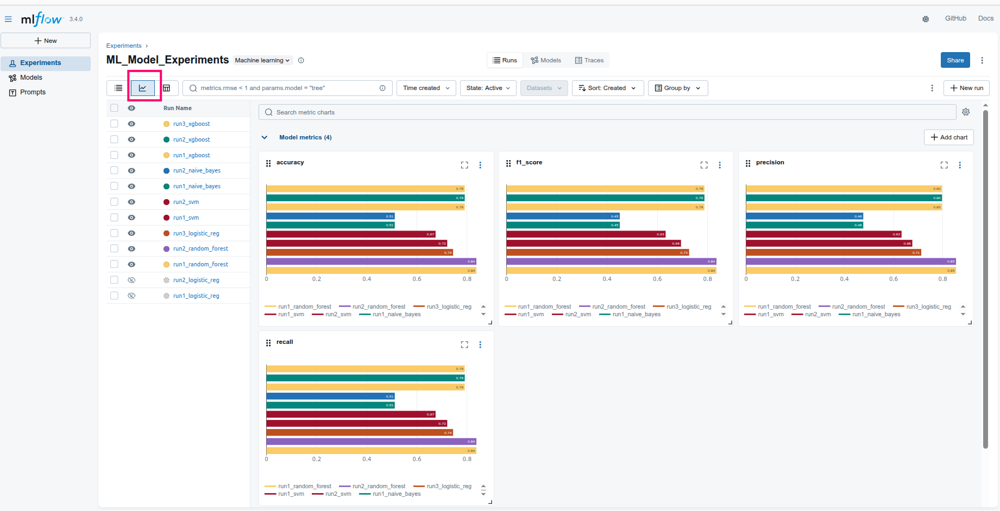
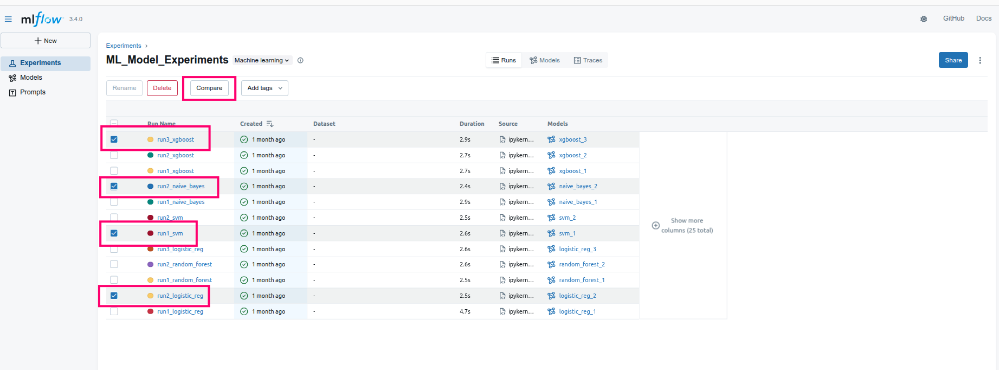
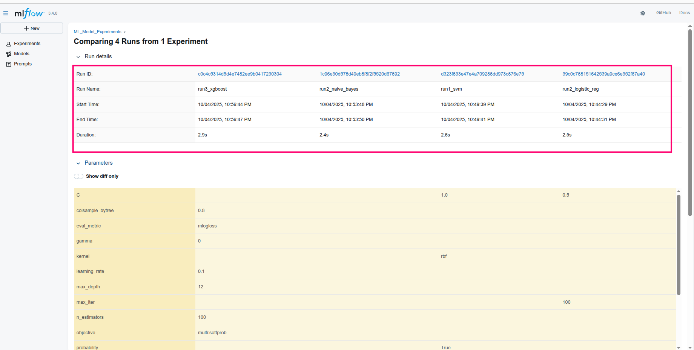
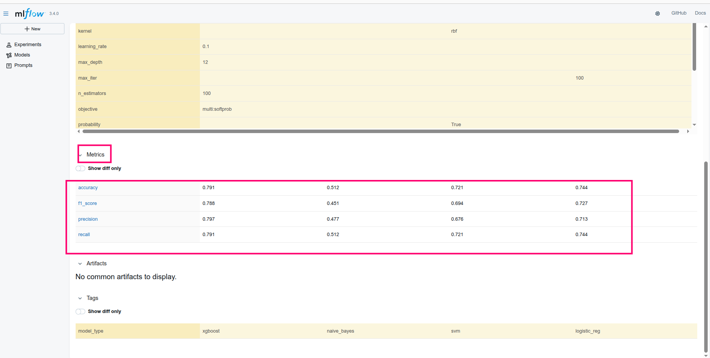

# MLflow Learning

**Author: Abhishek Dey**


## Create virtual environment

```

create conda -n mlflow_env python=3.10

conda activate mlflow_env

pip install -r requirements.txt

```

## Download Sample dataset 

* Download Glass Classification Dataset from the below link

```
https://www.kaggle.com/datasets/uciml/glass

```

## Experimentation

* Follow the steps in the [Notebook](mlflow_experiments.ipynb)

## Launch MLflow UI on local host

```
mlflow ui

```

The UI will be launched in the below link

```
http://127.0.0.1:5000 

```

## On Launching the interface

<p align="left">

</p>

## Graphical comparison of the metrices across all models

<p align="left">

</p>

## Select models for comparison

<p align="left">

</p>

## Runtime comparison of selected models

<p align="left">

</p>


## Metrics comparison of selected models

<p align="left">

</p>
